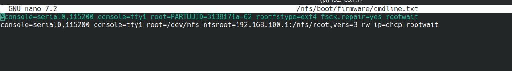

# PoC: network boot Client RPi from Server RPi

For this proof of concept, we are using two Raspberry Pi 5 devices.

## Steps to Reproduce

1.**Install Raspberry Pi 5 OS**:

- Use the Raspberry Pi Imager and install the lite version of the OS.

## Server setup

2.**Setup Raspberry Pi Server**

- Add a local network (Wi-Fi).
- Enable SSH on both the server and client Raspberry Pi.
- Boot and run

      sudo apt update && sudo apt upgrade

3.**Install Necessary Tools on the Server**:

- Install the following packages:

      sudo apt-get install isc-dhcp-server nfs-kernel-server tftpd-hpa iptables

4.**Configure Static IPv4 Address**:

- Use network manager - `sudo nmtui` to configure a static IPv4 address for the Raspberry Pi.
- 192.168.100.1 is used in this example.

   

5.**Configure DHCP Server**

- Use your static IPv4 address
- Edit the configuration file:

      sudo nano /etc/dhcp/dhcpd.conf

- Increase lease time and uncomment the `authoritative` directive.
- Configure the subnet settings accordingly.
  

6.**Configure `/etc/default/isc-dhcp-server`**

- Open and edit:

      INTERFACESv4="eth0"

7.**Restart DHCP Server**:

- The ethernet cable should be connected
- Restart and check the status of the DHCP server:

      sudo systemctl restart isc-dhcp-server.service
      sudo systemctl status isc-dhcp-server.service

- Enable DHCP on startup:

      sudo systemctl enable isc-dhcp-server.service

8.**Setup IP Forwarding and NAT (Optional)**:

- Enable IP forwarding by editing:

      sudo nano /etc/sysctl.conf

- Set/Uncomment `net.ipv4.ip_forward=1`.
- Set up NAT and iptables:

      sudo apt-get install iptables
      sudo iptables -t nat -A POSTROUTING -o wlan0 -j MASQUERADE
      sudo apt install iptables-persistent
      sudo systemctl start iptables
      sudo reboot

9.**Setup NFS Server**:

- NFS should be installed by default. If not, install it:

      sudo apt-get install nfs-kernel-server

- Create shared directories (`nfs/root`, `nfs/boot/`).
- Grant read, write, and execute permissions:

      sudo chmod -R 777 /nfs/root /nfs/boot

- Edit `/etc/exports` to add the NFS shares.

      /nfs/root *(rw,no_root_squash,sync,no_subtree_check)
      /nfs/boot *(rw,no_root_squash,sync,no_subtree_check)
        

- Apply exports with:

      sudo exportfs -a

- Restart and enable the NFS service:

      sudo systemctl restart nfs-kernel-server
      sudo systemctl enable nfs-kernel-server
      sudo systemctl status nfs-kernel-server

10.**Configure TFTP**:

- TFTP is already installed in step 2: `tftpd-hpa`.
- Open the TFTP configuration file and set the directory for remote clients to `boot`:

      sudo nano /etc/default/tftpd-hpa

- Should look like this:

      TFTP_USERNAME="tftp"
      TFTP_DIRECTORY="/nfs/boot/"
      TFTP_ADDRESS="192.168.100.1:69"
      TFTP_OPTIONS="--secure"

    

11.**Restart and Enable TFTP Server**:

- Restart and enable the TFTP server:

      sudo systemctl restart tftpd-hpa
      sudo systemctl enable tftpd-hpa
      sudo systemctl status tftpd-hpa

12.**Copy boot and edit `cmdline.txt`**

- Simply just copy boot

      sudo cp -r /boot/firmware/* /nfs/boot/

- Edit `nfs/boot/cmdline.txt` use static assigned IPv4 address

      console=serial0, 115200 console=tty1 root=/dev/nfs nfsroot=192.168.100.1:/nfs/root,vers=3 rw ip=dhcp rootwait

- Should look like this:

    

## Client setup

13.**Setup the Client**:

- Create directories on the client for NFS transfers:

      sudo mkdir /mnt/nfsroot 
      sudo chmod -R 777 /mnt/nfsroot 

- Mount the server directories on the client:

      sudo mount 192.168.100.1:/nfs/root /mnt/nfsroot

- Simply it is possible to just copy files from existing device or
- Use `rsync` to transfer the files from the client to the server:

      sudo rsync -avxHAXS --numeric-ids --info=progress2 --progress / /mnt/nfsroot

14.**Edit `fstab`  on the Client**:

- Update the `fstab` files to reference the NFS shares.
- These files are possible edit before/after transfer to the server.
- I would recommend to comment out original

- Edit `/etc/fstab` use static assigned IPv4 address

      192.168.100.1:/nfs/boot          /boot/firmware  nfs defaults  0  0
      192.168.100.1:/nfs/root          /               nfs defaults  0  0

- Should look like this:

    

15.**Reboot the Server and Boot the Client**:

- Reboot the server, remove the SD card from the client, and attempt to boot the client without an SD card.
- If boot is successful, confirm with `df -H`
- It should look like this:

    

16.**Optional: Need to fix `swap`**

- `dphys-swapfile` is fundamentally broken 
- Here's a recipe to get a swap file working

      sudo -s
      dphys-swapfile swapoff
      cd /var
      rm swap
      dd if=/dev/zero of=swap count=1024 bs=1MiB # adjust to the size you want 1024 is good for most Raspberries before the 4B.
      chmod 0600 swap
      mkswap swap
      dphys-swapfile swapon
      exit

17.**Update & upgrade client**

- If it still show any errors then update & upgrade & reboot

## References

1. [Raspberry Pi Documentation on Network Boot Flow](https://www.raspberrypi.com/documentation/computers/raspberry-pi.html#network-boot-flow)
2. [Raspberry Pi Configure Network Boot client](https://www.raspberrypi.com/documentation/computers/remote-access.html#network-boot-your-raspberry-pi)
